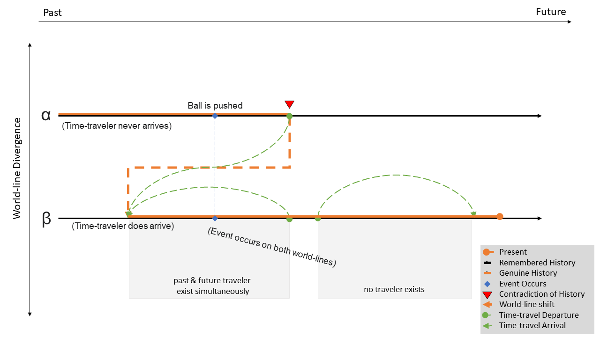
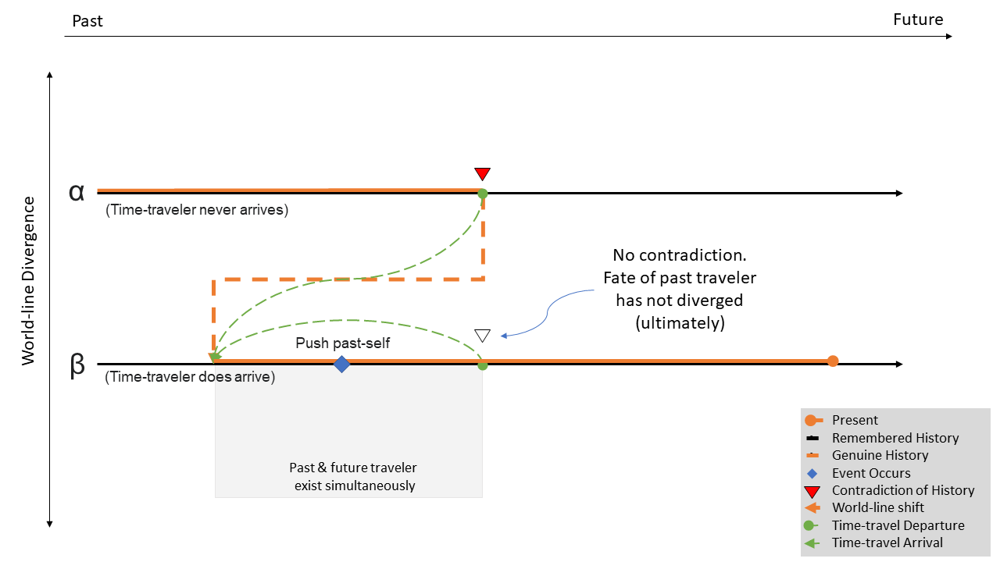
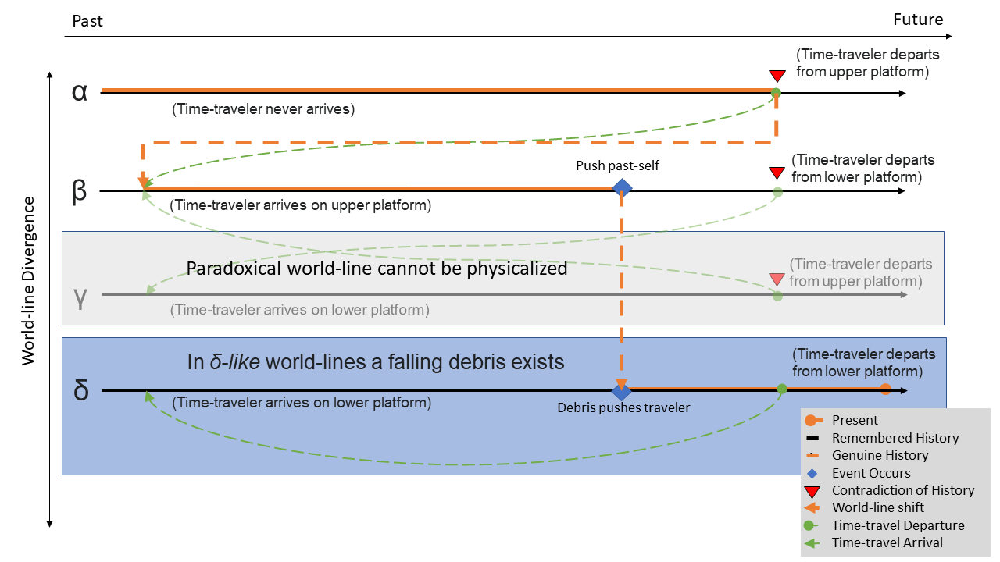
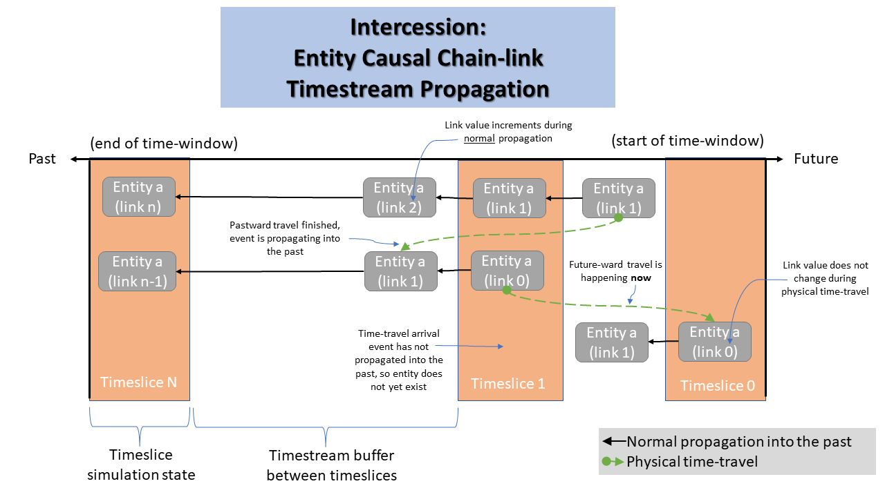
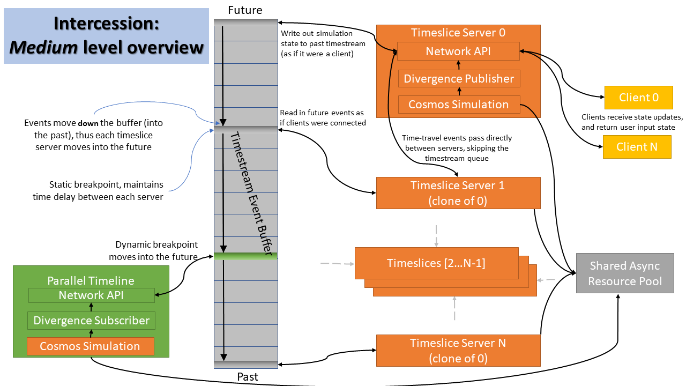

# Intercession: Space-Time Physics Simulation
### v0.12.0 "Proof of Concept"

## Abstract
This project implements a simplified simulation following the "Attractor Field Theory" of time-travel outlined in [this paper](https://github.com/Votuko/steins-gate-mechanics/blob/main/The%20Mechanics%20of%20Steins%20Gate%20v1.0.3.pdf) to show the possibility of resolving supposed physical paradoxes algorithmically.

## Table of Contents
- [Introduction](#introduction)
- [Case Studies](#case-studies)
- [Technical Overview](#technical-overview)
- [Bibliography](#bibliography)

---

## Introduction

First, a disclaimer: this project and the following document are not concerned with the fact or fiction of _how_ time-travel would physically work, be it [black hole gravity](https://www.youtube.com/watch?v=SYoR_aRRhAs), faster-than-light travel, [tachyons and flux particles](https://www.youtube.com/watch?v=I5cYgRnfFDA), magic, [crystals](https://www.youtube.com/watch?v=L3LHAlcrTRA), or any other [convoluted means](https://youtu.be/Pu6ixyJ_Y-0?si=kdpcCFkUQesLCPCv&t=204s). We'll suspend our disbelief of that detail and assume that some form of discontinuous "travel" through time is possible. We _will_ concern ourselves with the subsiquent physical consequences, given such a thing existed. Just remember, [parabolas are important](https://www.youtube.com/watch?v=Fkj6m8-Rg0Y).

### What Doesn't Work

Time-travel is a well-explored idea in science fiction and media, and there exist many interpretations of the physics of a cosmos where it is possible. The variation in these different ideas all stem from the potential for [temporal paradoxes](https://en.wikipedia.org/wiki/Temporal_paradox) which requires the addition of some _new physics_ to makes sense of or to avoid them. Our goal is to find an interpretation which fulfills the basic "fantasy" of time-travel (travelling into our own past, changing the course of history, and returning to the future to see the result), is simulatable in real time, and sensibly avoids paradoxes.

Before describing our desired interpretation, let's first identify the common interpretations that we are **not** interested in:

1. _Fixed Timeline_: All events in history have already occurred, including all instances of time travel. This interpretation works very well narratively, making for [great twists](https://www.youtube.com/watch?v=Mg1A7fB9nrk) and grand reveals. Paradoxes can be avoided because the human writer can bootstrap the course of history, tying up all loose ends. However it usually requires removing the possibility of free-will, or at least constraining it so heavily that simulating it would be practically impossible.

2. _Branch Realities_: Time-travel is actually travelling into a "parallel dimension". Paradoxes are avoided because you can [never actually change your own past](https://www.youtube.com/watch?v=mhu-_LT7Xyo). This is simply not actually time-travel.

3. _Anything Goes_: Free time travel is possible, but the time or place where paradoxes would occur are conveniently hidden out of view. This interpretation can create a [stunning illusion](https://www.youtube.com/watch?v=xbdTO5xqCJA), as long as you don't think about it too long.

4. _Information Only_: The only time-travel possible is through messages, visions, or your mind moving into a body of another time while everything else ["resets" around you](https://www.youtube.com/watch?v=hQCG2AwzTxA). These interpretations usually don't avoid logical paradoxes, but by limiting them to only information makes _physical_ paradoxes no longer possible, thus it becomes easier to suspend our disbelief.

5. _Forwards Only_: Previously science fiction, but for the last hundred years this is the real world. [Time Dilation](https://youtu.be/WqSL1prBvGw?si=pnPYcmWFNZmJRW1q&t=150) means that two entities can meet after experiencing different amounts of time. However, due to the limit of the speed of light, causality cannot be broken and paradoxes are not possible.

6. _[Novikov Self-Consistency Principle](https://en.wikipedia.org/wiki/Novikov_self-consistency_principle)_: Time travel is possible, but any action which _would_ cause a paradox can never happen. How such actions are practically avoided is unclear, possibly also eschewing free-will or requiring some other _new_ physics.

### What Could Work

In response to the Novikov self-consistency principle, Echeverria and Klinkhammer's resolution of [Polchinski's Paradox](https://en.wikipedia.org/wiki/Joseph_Polchinski#Polchinski's_paradox) suggests that potential paradox causing events **can** occur and instead be resolved given some _new_ physics which allows the history to change such that the causal loop becomes self-consistent.

The _new_ physics **this project** supposes to solve such paradoxes is following the "Attractor Field Theory" as explored in [this paper](https://github.com/Votuko/steins-gate-mechanics/blob/main/The%20Mechanics%20of%20Steins%20Gate%20v1.0.3.pdf) and the science fiction source material [Steins;Gate](https://en.wikipedia.org/wiki/Steins;Gate_(TV_series)). You are encouraged to read that material to better understand the concepts, though we will explore a simplified version here.

This is the basic synopsis of attractor field theory: 
1. All possible realities exist as potential world-lines (paths through space & time).
2. At any moment **one** of these world-lines exists and is physicalized in the cosmos from the beginning to the end of time.
3. Certain events can cause the history of the world-line to diverge.
4. When history diverges the physicalized world-line shifts to another potential world-line who's history is self-consistent with the effect of the divergence and is **most congruent** with the previous world-line.

You can see that this interpretation lends much more coherently to be simulated. With this setup, the problem of time-travel is reframed into the problem of which rules (or _dice_) god would use to pluck out new world-lines. Let's examine some example situations and see what could happen.

## Case Studies

>Note that we must practically limit the minimum length of time-travels to at least a few seconds. For these demonstrations we just a jump delta of 10 seconds.   Trips too near into the past or future often create [trivial and/or silly effects](https://www.youtube.com/watch?v=0-6GhgpVo9g).

### Moving Forward & [Leeward](https://www.youtube.com/watch?v=JbTT5b-wDYs) Through Time

To get our feet wet, lets examine what it looks like to change travel into the past, and then return _back to the future_.

<video src="./documentation/case_1.mp4" type="video/mp4" width="1280" height="540" controls></video>

In this example we push a _fictionless_ (for the purposes of demonstration) sphere, and set it in motion. Then we time-travel backwards to observe the moment of interaction. Next we travel forwards and we can see that the sphere has continued to slide during our subjective [skipped time](https://www.youtube.com/watch?v=gM5zAQFl5k4&t=24s).

This is what the progression of the world-line might look like in this trivial case:

Note that every entity _inside_ the simulation only has memories (or ANY lasting effects) of events which occurred in the current world-line's history, called the "remembered history", even though they may have experienced a different "genuine history" (like us, outside of the simulation). Once the world-line is reconstructed their memories are also reconstructed, and thus they will match. Any memories of the previous world-line are effectively erased. So in this case, the time-traveller does not remember experiencing the world-line where they did **not** see themself appear in the past.

### Changing the Past within an Attractor Field

Typically it is reccommended to be [cautious with pastward time travel](https://www.youtube.com/watch?v=vCoXnTqUTbI). But like the previous example, not all divergences of the past need to cause shifts into drastically different world-lines:

<video src="./documentation/case_2.mp4" type="video/mp4" width="1280" height="540" controls></video>

In this example we spend some time moving in circles before moving to the centre of the platform and then travelling back in time. After travelling we diverge our own history _trivially_ by knocking ourselves off course a few times. However, despite this our (subjective) present remains unchanged, why? Lets examine how the world-lines of this case might look:

Like the resolution of Polchinski's Paradox, the changes in the past are trivial enough to still result in the same fated future. Thus the beta world-line naturally becomes self-consistent. 

### Changing the Past and Resolving Paradoxes

Now let's examine a case where a time-traveller creates a non-trival divergence in the past:

<video src="./documentation/case_3.mp4" type="video/mp4" width="1280" height="540" controls></video>

Does that make sense?

Yes? No? What the hell just happened?

First, note that the ledge is too high for our controlled observer to "walk" over. Next we move to the edge and wait for a moment of foreshadowing. Now we travel back in time and invoke a paradox by pushing ourselves over the ledge. Since our past-self can now no longer walk to the location where it is fated to **depart** into the past, that means that our present-self can never have **arrived** from the future to push ourselves.

This world-line is no longer self-consistent.

So instead we are taken to a new one! We find ourselves in a new course of history where not only ourselves and the platforms exist (there was no reason why only those three entities existed. The existence of the delta world-line is no less plausable than the existence of alpha). In this world-line this cube-shaped debris also exists, and it **just so happened** to fall and push us at the exact moment we would otherwise have been pushed from the ledge ourselves. Here on this world-line, we instead depart into the past from the lower platform resulting in our new position in the present.

Thus, the timeline is self-consistent. This is what the progression of the world-line might look like:

You could imagine a number of other possible world-lines which could also have been appropriate. Perhaps the observer could have thrown themselves voulentarily from the ledge or they could have jumped back up (given the ledge was short enough). Perhaps some other existing object in the cosmos could have changed history or another kind of force could have been applied to knock them down.

## Technical Overview

### The Timestream

The fundamental component of the timeline simulation is the "World-line-Entity". It is the space-time composite of all entities which create a contiguous path through history. E.G. We would say a "person" is a world-line-entity, which is composed of all instances of themself at every point in time now and in the past & future.

Each entity is represented by a 32 bit identifier which is composed of 3 pieces of information:

| Bit Range | Value | Description |
| --------- | ----- | ----------- |
| [0,8)     | **Timeslice Host Id** | The point in time (aka timeslice) the entity's "genesis"/creation occurred in. This value is used for orchestrating concurrency among different threads operating on one world-line-entity. |
| [8,24)    | **Genesis Id** | A simple incrementing counter. Used to differentiate different world-line-entities. |
| [24,32)   | **Causal Chainlink Id** | The ordered position this entity comes in the history of the world-line-entity it composes. Future link values < Past link values |

If we mask out just the Timeslice Host Id and the Genesis Id, we get an identifier for all entities who are part of one world-line-entity. From those entities we can mask out the Causal Chainlink Id to determine the place of each entity in time. When an the state of an entity propagates into the past (I.E. your state of sleeping has propagated into the past, since you are now awake) its chainlink value is incremented by one.

What does it mean to "propagate into the past"? We divide up an accessable range of time into a (configurable) number of partitions. Each partition is bookended by a simulation of that particular cross-section in time, we call this the "timeslice". In between each timeslice is a buffer of unsubstantiated time. This continuous series of buffers we call the "timestream". Let's see how one world-line-entity moves through the timestream in a typical, non-paradoxical scenario:

You can see by using this strategy we can avoid any single entity colliding with itself in the timestream buffer. By the time entity _a_ (link 1, bottom row) arrives in timeslice 1, entity _a_ (link 1, top row) will necessarily have departed from timeslice 1 to become entity _a_ (link 1, middle row).

Furthermore, these link values allow us to perform one other crutial component, which we'll get to later

----

### Divergences

Now, when an entity starts to mess with the past we need a way to resolve any divergences it creates. Let's zoom out from just the timestream to get a larger overview of the architecture:

Above you can see where each timeslice simulation accesses the timestream from a fixed point in time. At the start of each from each simulation will read in the state above it and update its simulation "cosmos" as necessary. At the end of each from the simulation will write out its state to the timestream. This reading above and writing below cause the events of the timestream to _flow_ into the past.

When an entity requests to directly time-travel, its current timeslice will delete it and send it directly to its destination timeslice (avoiding waiting in the timestream)

Now here's where the magic happens. Because we have access to the chainlink value of all entities during the simulation we can _compare_ chainlink values between them when they interact. If two entities of _different_ chainlink values interact we detect this as a divergence of history. When this happens we can mark the entity of **higher** chainlink as divergent and let it stop following its future from the timestream. The current timeslice will begin simulating it independantly. Of course this could then create knock-on effects. If a divergent entity interacts with a non-divergent entity we similarly detect this as a divergence of history.

Now that the timeline is beginning to unravel, and some divergent entities have forked from their fate, we need to reconstruct the timestream to follow this new world-line. This is where the "Parallel Timeline" component comes into play.

When a divergence event occurs, the Parallel Timeline is woken up. It attaches a dynamic breakpoint into the timestream and re-simulates the whole timeline from past to future. This breakpoint continuously consumes future events as fast as possible (as fast as the cpu can), rather than staying fixed like the timeslice breakpoints (consuming 1 second per 1 second).

Once the parallel timeline catches up with timeslice 0 (farthest into the future), in its wake it has written out a contiguous history.

So [rather than a river](https://youtu.be/qjm5eNlXln4?si=PBS3By3deMEUoLa4&t=30), we can think about time like a VHS tape. We can splice in a new tape as it plays and it will begin to replace the old one, until it has played all the way through and the old tape has been completely ejected.

---

### Intercessions

A natural issue arrises by using this past-to-future reconstruction: we cannot guarantee **future-to-past** self-consistency. For example, if a pastward time-traveller is re-simulated and is found to depart in a different location from where it arrived, this is no longer self-consistent.

To combat this we can cycle the parallel timeline **again** and use information of future events to reconstruct the timeline such that the past is corrected. In the previous example, we can change the time-travelers arrival location to match its departure. However, this new reconstruction can just lead to another inconsistency, and so on, and so on, flipping back and forth between different world-lines due to the paradox.

This is where the final piece of the puzzle comes into play, the **Intercession**.

During the parallel timeline reconstruction we cache meta-data about the divergent entities. When we detect this paradoxical loop, we can query the history of interactions, positions, and behaviours of the paradoxical entity(s) to get a picture of the state of the timeline at the inciting incident. Because we don't have access to the infinite space of all possible world-lines to draw from (TBD), using some human assumptions we can categorize these situations into different categories which we can map to certain modifications of the cosmos (adding, changing, or removing entities) to make it self-consistent. As of now, this process must be manually tailored to create plausible reconstructions, but further investigation could disover a more flexible method.

[In the earlier example](#changing-the-past-and-resolving-paradoxes) we replaced the collision between the user entity (link 0) and the user entity (link 1), with an equivalent collision between debris (link 1) and the user entity (link 1). Who _really_ pushed them? In some sense, it was both. But only one history is ultimately true.

Because of this, the fate of the user entity (link 0) is no longer dependant on itself, avoiding a paradox. Plus, since both world-lines contain the same resultant collision effect on the user entity (link 1), its fate (falling off the ledge) becomes what was expected by the time-travelers inital actions.

## [To Be Continued](https://www.youtube.com/watch?v=fiwcZ0pg3xM)

## Bibliography
Special thanks to the following resources, programmers, and teachers for their invaluable and selfless work which I was able to learn from and adapt to produce this project. (Not including the libraries which I used directly).

It is amazing what you can learn for free on the internet.

* https://learnopengl.com/ - Fundamentals of Opengl and graphics concepts
* http://www.opengl-tutorial.org/ - Geometry and graphics concepts/resources
* https://www.thecherno.com/ - Extensive resources and topics related to game engines, based on the Hazel project
* https://community.onelonecoder.com/ - Aka Javidx9. Extensive c++ topics and inspiration to build things yourself
* https://www.youtube.com/c/CodeTechandTutorials - c++ and project management (cmake) walkthroughs
* https://austinmorlan.com/ - Walkthrough and intuition of ECS architecture
* http://hitokageproduction.com/article/11 - Walkthrough and intuitions of 3D collision and physics